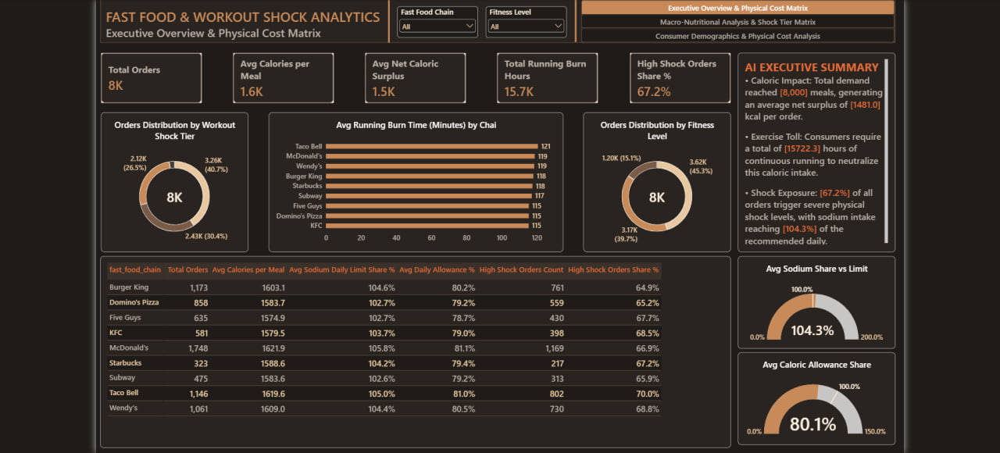
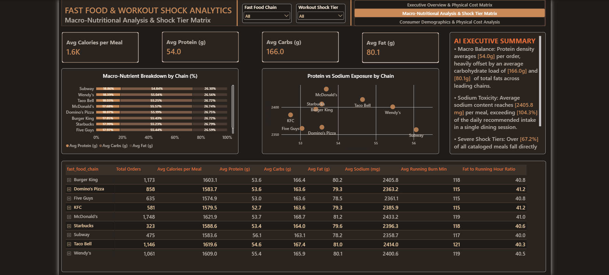
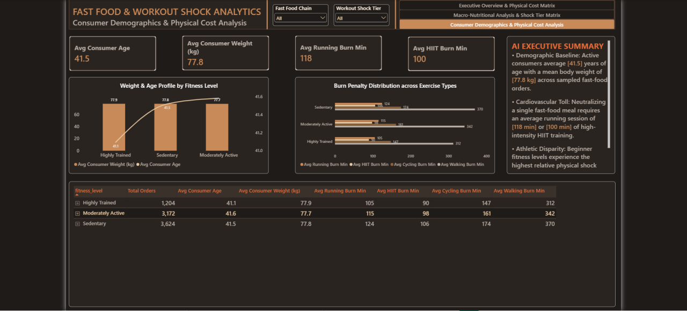

# Fast Food Macro-Nutritional & Workout Shock Analytics Dashboard

In fast-paced quick-service restaurant (QSR) environments, high-calorie, sodium-dense fast food consumption presents significant health risks and physiological recovery challenges. Quantifying the actual physical toll—specifically the workout duration and athletic burn penalty required to neutralize fast-food caloric surpluses—requires structured dimensional modeling, rigorous DAX metrics, and an executive-grade dashboard UI/UX.

I designed and developed this end-to-end interactive 3-page Power BI dashboard (analyzing 8,000 granular order transactions) to evaluate macro-nutritional distributions, sodium toxicity exposure, and fitness-level physical recovery costs across leading global fast-food chains.

---

## Executive Summary & Performance Overview

The primary view consolidates top-level operational and physical impact metrics to provide an immediate health check of total order volume, caloric density, and cardiovascular burn penalties.

* **Macro Commercial KPIs:** Tracks Total Demand (8K Orders), Average Calories per Meal (1.6K kcal), Net Caloric Surplus (1.5K kcal), and Aggregate Running Burn Hours (15.7K hours).
* **Workout Shock Classification:** Categorizes order volumes across Low, Moderate, High, and Extreme Shock tiers, exposing that 67.2% of all orders trigger severe physical recovery strain.
* **Toxicity & Allowance Benchmarks:** Gauges average sodium intake against recommended daily limits, revealing a 104.3% daily allowance overload in a single dining session.

---

## Key Dashboards Included

### 1. Executive Overview & Physical Cost Matrix

Establishes the macro-baseline between meal consumption and total exercise neutralization requirements.

* **Chain-Level Running Penalty:** Isolates running burn minutes across major QSR brands (ranging from 115 min up to 121 min per meal).
* **Fitness Profile Distribution:** Segments order populations by baseline physical activity levels (Sedentary, Moderately Active, Highly Trained).
* **Chain Comparison Matrix:** Provides a structured matrix detailing total orders, caloric surplus, sodium threshold breaches, and high-shock share percentages.

### 2. Macro-Nutritional Analysis & Shock Tier Matrix

Delivers granular visibility into macronutrient breakdowns (Protein, Carbs, Fats) and identifies chains driving extreme sodium exposure.

* **Macro Ratio Deconstruction:** Analyzes the 100% stacked nutritional breakdown, showing that moderate protein loads (54.0g) are heavily offset by excessive carbs (166.0g) and total fats (80.1g).
* **Protein vs. Sodium Exposure Scatter Plot:** Maps fast-food chains on a 2D matrix to isolate high-sodium, low-protein menu drivers.
* **Micro-Nutritional Detail Matrix:** Evaluates chain-specific averages alongside calculated Fat-to-Running-Hour ratios.

### 3. Consumer Demographics & Physical Cost Analysis

Correlates consumer demographic traits (Age, Weight) with exercise recovery penalties across multiple activity types.

* **Demographic Baseline Profiling:** Examines consumer age (avg 41.5 years) and body weight (avg 77.8 kg) trajectories mapped against fitness tiers.
* **Multi-Activity Burn Penalty:** Compares required exercise duration across 4 distinct disciplines (Running, HIIT, Cycling, and Walking).
* **Interactive Drill-Down Matrix:** Features a multi-level hierarchy (Fitness Level -> Fast Food Chain -> Meal Category) for deep-dive analytical exploration.

---

## Strategic Business & Health Insights

* **Nutritional Menu Transparency:** Advocates for "Physical Cost" labeling on QSR menus to inform consumers of the exercise time required to offset meal caloric intake.
* **Recipe Reformulation Strategy:** Highlights the critical need for fast-food chains to reduce sodium content by at least 25% to prevent single-meal daily threshold breaches.
* **Targeted Athletic Recovery:** Identifies that Sedentary consumers suffer the highest relative physical penalty (requiring 370 min walking or 124 min running), demonstrating the necessity of high-efficiency exercise regimens like HIIT to reduce recovery time by 20%.

---

## Data Architecture & Modeling

To ensure optimal query performance and enterprise-grade scalability, the analytical model was engineered using strict data architecture standards:
* **Star Schema Architecture:** Centralized `Fact_Meals` transactional table surrounded by standardized dimension tables for fast cross-filtering and drill-down operations.
* **Custom DAX Logic:** Fully developed calculation engine handling unit standardizations (converting exercise hours to minutes), dynamic threshold percentages, and multi-variable metric aggregations.
* **Design & UI Standardization:** Formatted using an executive-grade "Espresso / Warm Mocha" dark theme, adhering to accessibility contrast guidelines and clean typography hierarchy.
